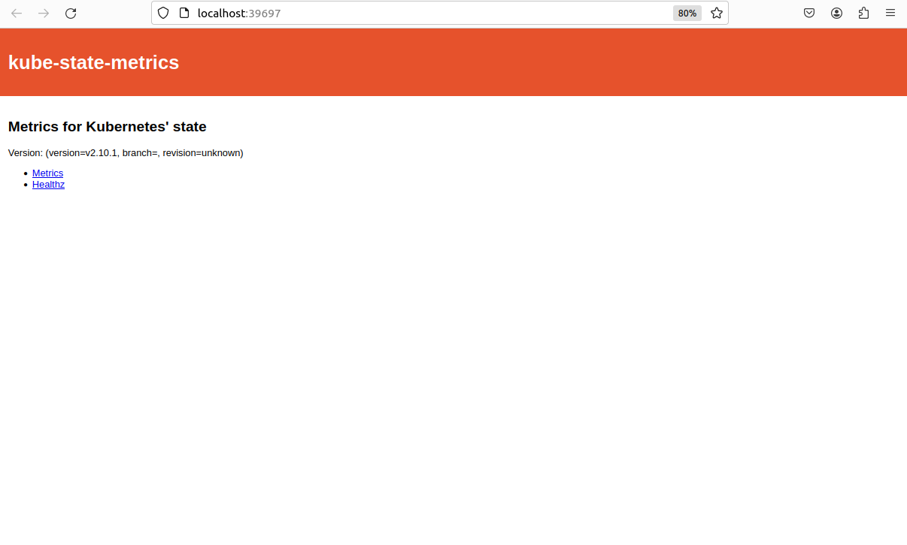
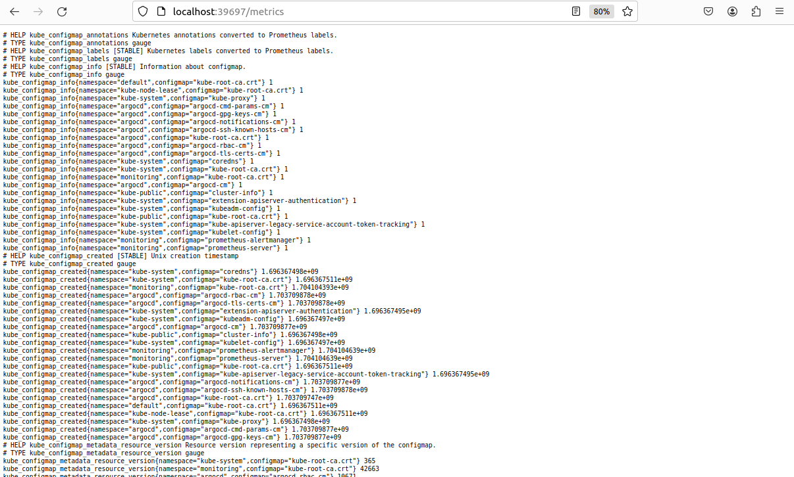
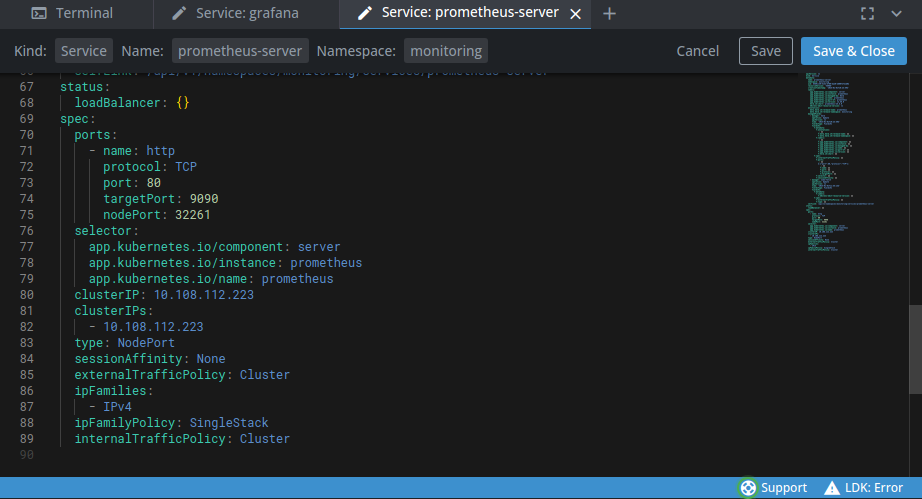
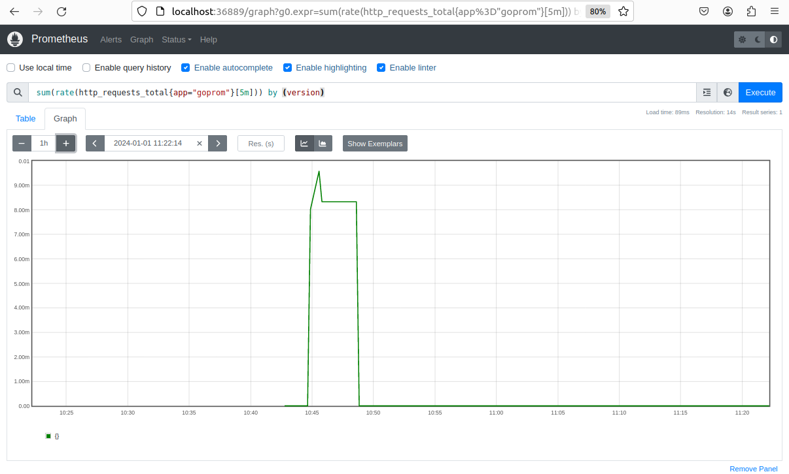
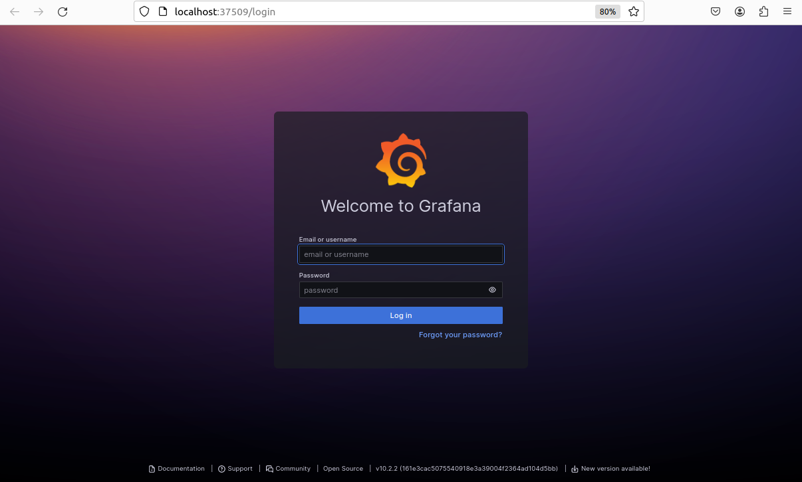
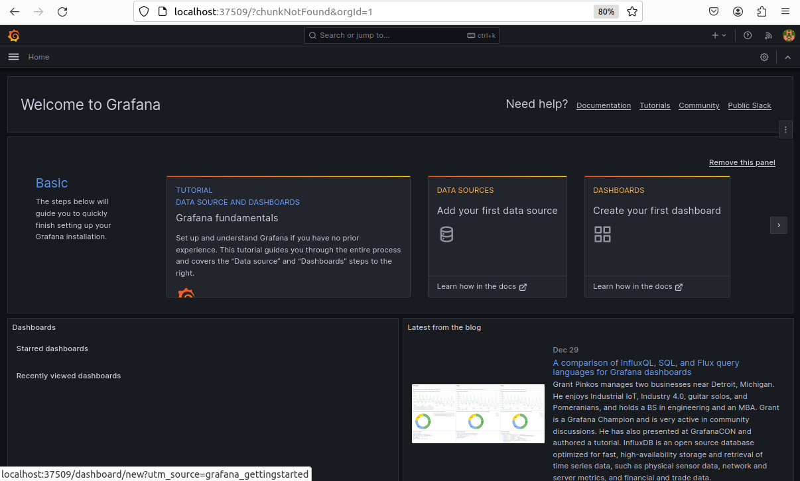
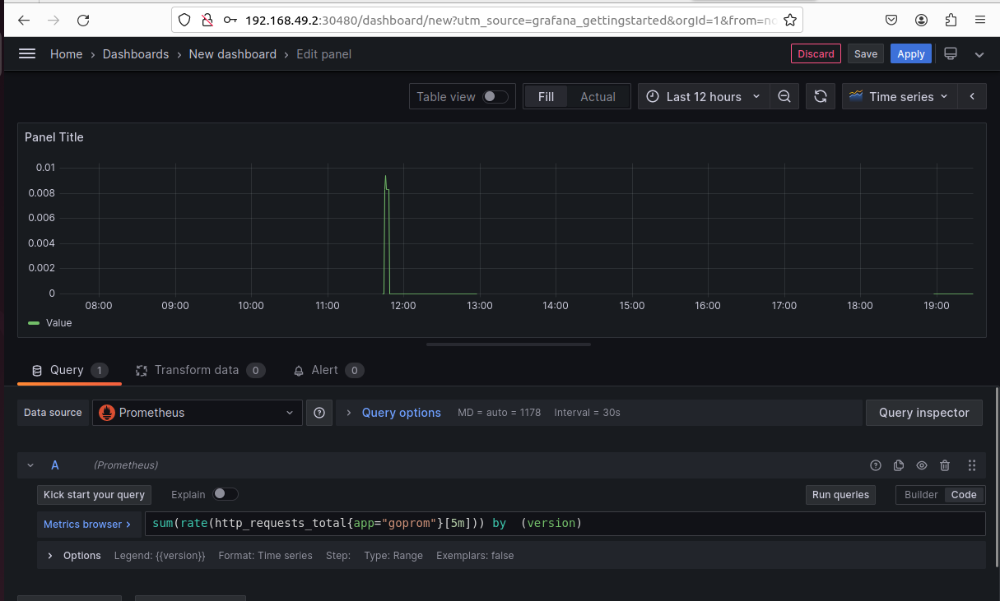
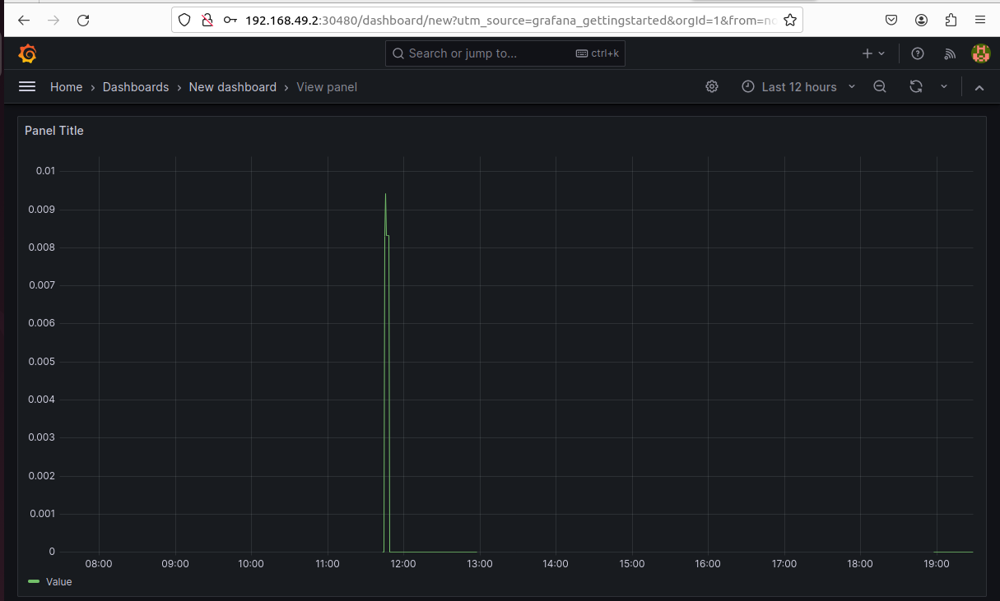

# monitoring
Tout d'abord j'ai suivi tout les commandes de l'installer de Prometheus avec Helm , kube-state-metrics et le monitoring du cluster et les étapes pour le déployement de notre application d’exemple (goprom) et la connection à prometheus. Voici les captures suivante:

L'interface de service goprom

L'interface de service goprom-metrics

et aprés pour tester le service prometheus-server j'ai changer le type en mode NodePort par l'application grphique Lens :

Puis j'ai vérifiée que prometheus récupère bien les métriques de l’application avec la requête PromQL :

Et derniérement étape j'ai installer et configurer Grafana pour visualiser les requêtes :

Connection a grafana :   

L'ajout de DataSource : 

La creation de dashboard :

et finalement la visualisation du graph :

